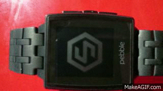

# Pebble--- Address-Finder
## Useing pebble.js, Simply.js and google Geocode API to find your current address

### Example 



### Code
```javascript
navigator.geolocation.getCurrentPosition(function(pos) {
  
  simply.scrollable(true);
  simply.vibe('short');
  simply.style("small");
  
  var coords = pos.coords;
  var geourl = 'https://maps.googleapis.com/maps/api/geocode/json?latlng=' + coords.latitude + ',' + coords.longitude + '&key=geocodeAPIKey';
  ajax({ url: geourl, type: 'json' }, function(data) {
    simply.text({ title: "Your Current Location: " + data.results[0].address_components[3].long_name, subtitle: data.results[0].formatted_address}); 
  });
});

```

 change `&key=geocodeAPIKey` to your google api API key


 gets lat and long throught javascripit navigator.geolocation.getCurrentPosition(function(pos)

 sends ajax request to google geocode with current lat and long

 google geocode returns json data of current location 

 parse json to return results[address_components[type[loaclity]]] and results[formatted_address]

 prints with simply title, subtitle and text

 on load vibe(short) and allows scrollable text to screen is not locked


